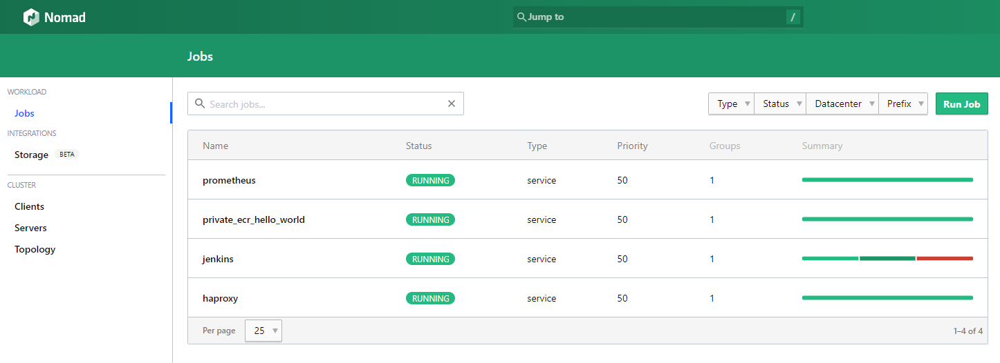

# Terraform On Aws

Terraform On Aws

## ssh key 생성

[참고](https://jhooq.com/terraform-ssh-into-aws-ec2/)

### key-pair 생성(ssh-keygen 이용)

파일명은 `/home/skyer9/.ssh/aws_key` 처럼 전체 경로를 적어 주어야 합니다.

비밀번호는 입력하지 않습니다.

```bash
ssh-keygen -t rsa -b 2048
--------------------------------------
Generating public/private rsa key pair.
Enter file in which to save the key (/home/skyer9/.ssh/id_rsa): /home/skyer9/.ssh/aws_key
Enter passphrase (empty for no passphrase):
Enter same passphrase again:
Your identification has been saved in /home/skyer9/.ssh/aws_key
Your public key has been saved in /home/skyer9/.ssh/aws_key.pub
The key fingerprint is:
SHA256:dAjs1z4U2pZxskXXXXXXXXXXXXXXXXXXXXX skyer9@notebook
The key's randomart image is:
+---[RSA 2048]----+
|     ..     ..+*=|
|      ..+.* ..oB+|
|   XXXXXXXXXXXXXX|
|      ..=.X  .E.+|
|       .S= .  .oo|
|        XXXXXXXXX|
|     XXXXXXXXXXXX|
|   XXXXXXXXXXXXXX|
|             o   |
+----[SHA256]-----+

```

```bash
ls -al .ssh/aws_key*
--------------------------------------
-rw------- 1 skyer9 skyer9 1823  8월 28 20:34 .ssh/aws_key
-rw-r--r-- 1 skyer9 skyer9  397  8월 28 20:34 .ssh/aws_key.pub
```

```bash
aws ec2 import-key-pair --public-key-material file://~/.ssh/aws_key.pub --key-name aws_key
```

## 인증서 생성

```bash
cd acm

terraform init
terraform validate
terraform plan

terraform apply

# terraform destroy
```

## Consul Server Cluster 생성

```bash
cd ../consul_server_cluster

terraform init
terraform validate
terraform plan

terraform apply

# terraform destroy
```

## Nomad Server Cluster 생성

```bash
cd ../nomad_server_cluster

terraform init
terraform validate
terraform plan

terraform apply

# terraform destroy
```

## Nomad Client Cluster 생성

```bash
cd ../nomad_client_cluster

terraform init
terraform validate
terraform plan

terraform apply

# terraform destroy
```

## Job 생성

`Run Job` 버튼을 이용해 Job 을 생성합니다.



- haproxy.nomad
- prometheus.nomad
- jenkins.nomad
- grafana.nomad
